# Civilon Price Check Admin Operations Guide

**Audience:** Civilon analysts, reviewers, administrators, and auditors

**Operating status:** Production is live as of August 2026. Use only through the owner-approved Civilon admin environment and current legal/privacy controls.

**Companion guides:** [Quick Start](CIVILON-PRICE-CHECK-QUICK-START.md) · [Roles](CIVILON-PRICE-CHECK-ROLES.md) · [Troubleshooting](CIVILON-PRICE-CHECK-TROUBLESHOOTING.md) · [Sample Responses](CIVILON-PRICE-CHECK-SAMPLE-RESPONSES.md)

> [!IMPORTANT]
> **AI does not determine market price.** AI extraction and explanation text are proposals only. A human must review every applied field and every customer-facing sentence. The deterministic analysis engine—not AI—calculates the observed low, median, high, and classification from staff-selected governed comparables.

## Language and information boundaries

Describe the service as a **Price Check** based on **observed comparable evidence**. It is not an appraisal, valuation certificate, guaranteed fair market value, or statement of supplier cost or margin.

Never tell a customer they “overpaid,” were “ripped off,” or that a supplier cheated them. Never disclose raw comparable records, customer or supplier provenance, analyst notes, internal/AI metadata, credentials, cookies, tokens, or secure result URLs. Customer output may use only:

- **BELOW OBSERVED RANGE**
- **WITHIN OBSERVED RANGE**
- **ABOVE OBSERVED RANGE**
- **INSUFFICIENT COMPARABLE EVIDENCE**

## 1. Sign in and open the queue

Open `/admin/login`, choose the configured Google sign-in, and complete authentication with an invited identity. Authentication alone is not authorization: the account must also be bound to an active local staff record. Never share a session or capture cookies/tokens in screenshots or support messages.

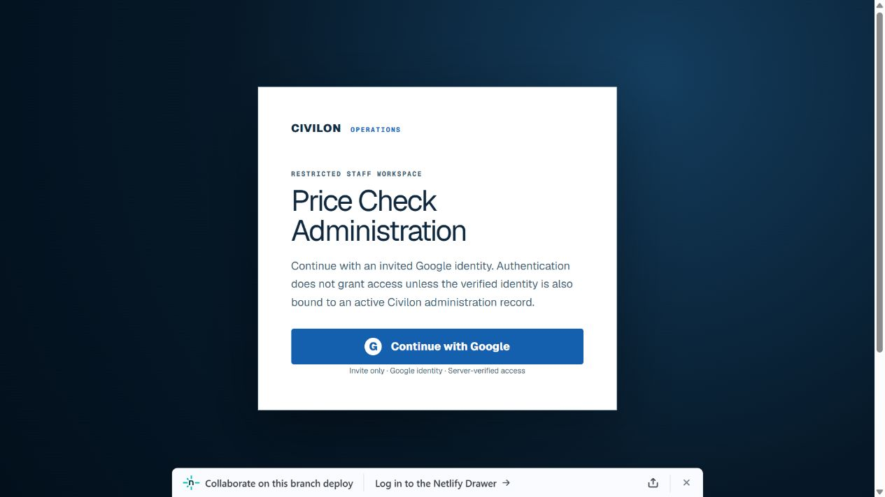

The `/admin/price-checks` queue shows status, AOG flag, assignee, condition, transaction type, age, and bounded search/filter controls. It intentionally minimizes personal information. Start with **Submitted**, **Upload processing**, **Extraction review**, **Processing failed**, and **Needs information**; then check older unassigned work.

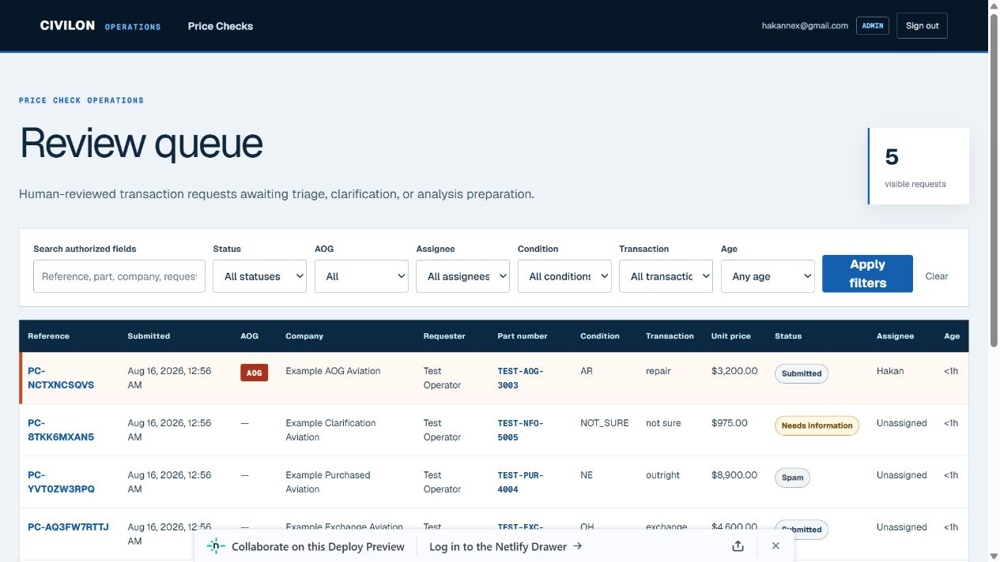

Click the blue Price Check reference (for example `PC-XXXXXXXXXX`) in the **Review Queue** to open the request. Staff do not need to know the internal database ID.

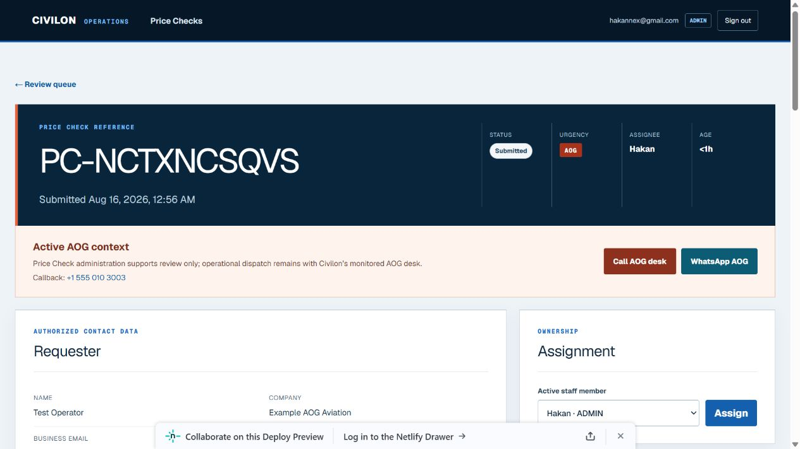

## Understanding the Price Check screen

The live request page now follows the same five phases used throughout this guide. Start with the status header, read the **Recommended next action**, and use the sticky section links instead of scrolling without a plan.

| Number | Section | What it does | What staff does here | When you are done |
| --- | --- | --- | --- | --- |
| 1 | Status / request header | Identifies the reference, persisted status, urgency, owner, and age | Confirm you opened the intended request and read the workflow map | The status and recommended action are understood |
| 2 | Customer & original submission | Shows who submitted the request and the immutable customer-entered transaction | Verify contact context and read the submission without editing it | The original facts and any gaps are understood |
| 3 | Documents | Shows requirements, uploaded files, and safety/scan state | Open or extract only files marked **Clean** | Relevant clean documents have been reviewed |
| 4 | AI extraction / reviewed transaction | Compares AI-proposed fields with the current record and preserves confirmed revisions | Confirm each field; apply only supported corrections with a reason | The reviewed transaction is the version Civilon should analyze |
| 5 | Comparable evidence | Shows governed candidates and include/exclude controls | Select only relevant evidence and explain every decision | The decision set is complete |
| 6 | Analysis & confidence | Runs deterministic calculations and records human confidence | Save analysis and explain confidence from evidence quality and limitations | An immutable current analysis exists |
| 7 | Explanation / customer result | Holds optional AI drafting, human editing, preview, approval, and send controls | Verify all customer-facing content; approve and send as separate actions | Delivery is queued or confirmed |
| 8 | Assignment / next actions | Shows role- and status-permitted operational controls | Assign ownership and use only the displayed valid actions | A clear owner and next workflow state are recorded |
| 9 | Delivery / jobs | Shows secure-delivery and background processing state | Monitor failures; leave successful technical history collapsed unless needed | Delivery succeeds or a safe recovery path is recorded |
| 10 | Audit history | Preserves append-only operational events | Expand only when reviewing history or troubleshooting | The relevant event trail has been confirmed |

## 2. Assign ownership

Analysts and reviewers may self-assign. Administrators may assign any active staff user. Confirm the current assignee before changing it; assignment is audited and does not alter the submission.

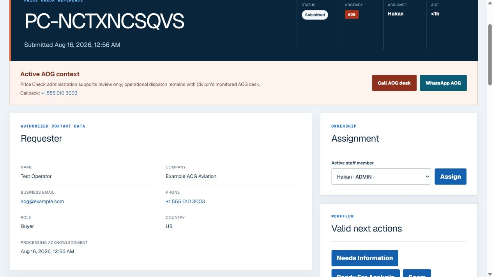

## 3. Understand workflow status

| Status | Operational meaning | Normal next action |
| --- | --- | --- |
| Submitted | Request accepted; initial triage not complete | Assign and review submission/files |
| Upload processing | One or more uploads are awaiting scan/reconciliation | Wait; Admin reconciles when appropriate |
| Extraction review | A clean document/proposal is available for human review | Review proposal or continue manually |
| Processing failed | A processing exception needs attention | Use manual path; Admin investigates/retries permitted operation |
| Needs information | Staff recorded a customer clarification request | Await response; do not claim a message was delivered unless delivery is verified |
| Ready for analysis | A human-confirmed transaction revision is ready | Select comparables and create analysis |
| Analysis ready | A persisted deterministic analysis exists | Draft customer explanation/result |
| Human review | Result content awaits authorized review | Edit, verify, and approve |
| Approved | Result is frozen for delivery | Send and monitor delivery |
| Sent | Provider delivery succeeded and result is available | Respond to questions; monitor sourcing request |
| Quote requested | Customer selected Get a Civilon Quote | Follow sourcing opportunity |
| Converted | Sourcing opportunity converted | Close when complete |
| Closed | Completed terminal state | No further workflow action |
| Spam | Terminal exception | No further Price Check action |
| Withdrawn | Customer withdrawal | No further Price Check action |

Only valid state-machine transitions appear. Admin-only exceptional actions include `processing_failed`, `spam`, and `closed` where the domain permits them. Never force a status merely to unlock a screen.

### What do I do next?

The request page displays a status-derived **Recommended next action**. It is help text only: it never changes status or performs an operation. Follow the visible phase, then use the right-side controls that are permitted for your role.

### Three common workflows

**A. Customer entered everything manually**

Review the immutable submission → create a documented revision only if required → select comparables → save deterministic analysis → prepare and review the result.

**B. Customer uploaded a quote**

Wait for **Clean** → trigger extraction only if useful → verify every proposed field → apply supported fields as a revision → select comparables → analyze and prepare the result.

**C. Customer requested a Civilon quote**

Open the linked sourcing opportunity → contact the customer through the approved channel → begin sourcing follow-up → close only when the operational work is complete.

## 4. Request more information

Use **Request More Information** when a material fact is missing or contradictory. Choose the closest category and write a short customer-facing clarification that names what is needed without revealing internal analysis. This records the request and moves the case to **Needs information**.

Important: the action records workflow/audit state. Do not say an email was sent unless a delivery record confirms it. Use the approved template in [Sample Responses](CIVILON-PRICE-CHECK-SAMPLE-RESPONSES.md).

## 5. Review uploaded documents safely

Uploads are optional. The attachment record and the Price Check workflow are related but separate.

| Attachment state | Meaning | Staff action |
| --- | --- | --- |
| Pending | GuardDuty tag is absent/pending or reconciliation is incomplete | Do not download or extract; wait |
| Clean | `NO_THREATS_FOUND` plus server validation/digest checks succeeded | Authorized staff may download/extract |
| Rejected | Threat found or content/signature/safety validation rejected it | Never open/process; request a replacement if needed |
| Failed | Unsupported, access denied, scan failure, mismatch, or unknown failure | Fail closed; continue manually or Admin retries reconciliation |

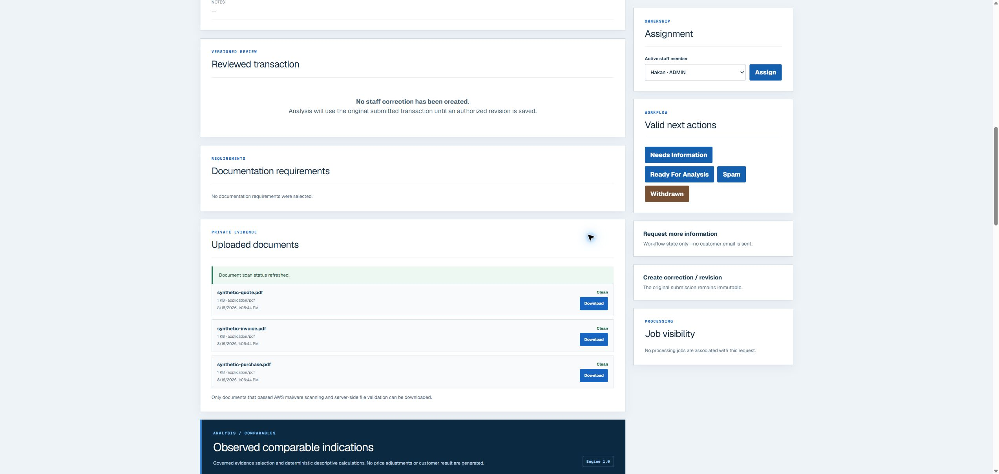

Only a **Clean** document may be downloaded or sent to extraction. GuardDuty clean status is necessary but not sufficient: server-side type, size, PDF/image limits, and digest validation must also pass. Rejected/failed files are not evidence; never bypass the gate.

## 6. Use AI document extraction

Extraction is staff-triggered and optional. It proposes structured facts from one clean document; it does not price, select evidence, determine fairness, approve a result, or create an observation.

1. Confirm the file is Clean and belongs to the request.
2. Select **Extract** only if the document can reduce manual entry.
3. Wait for `pending/running` to become `succeeded`; failure does not block manual review.
4. Review every proposed line item and evidence cue against the document.
5. Select the correct line when the document has multiple items.
6. For each field choose **Accept proposal** or **Keep current**.
7. Enter a change reason and create the revision.

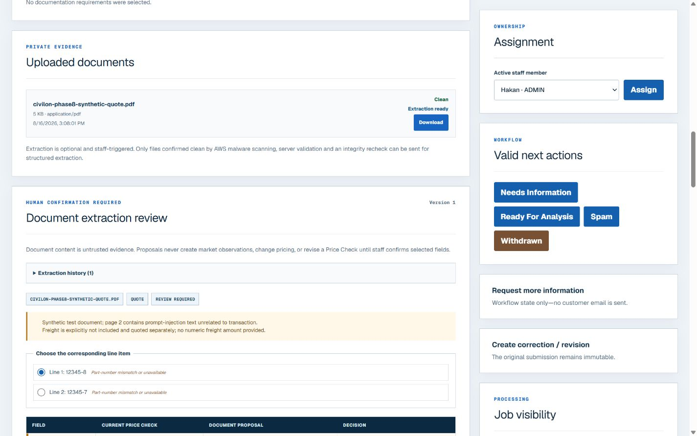

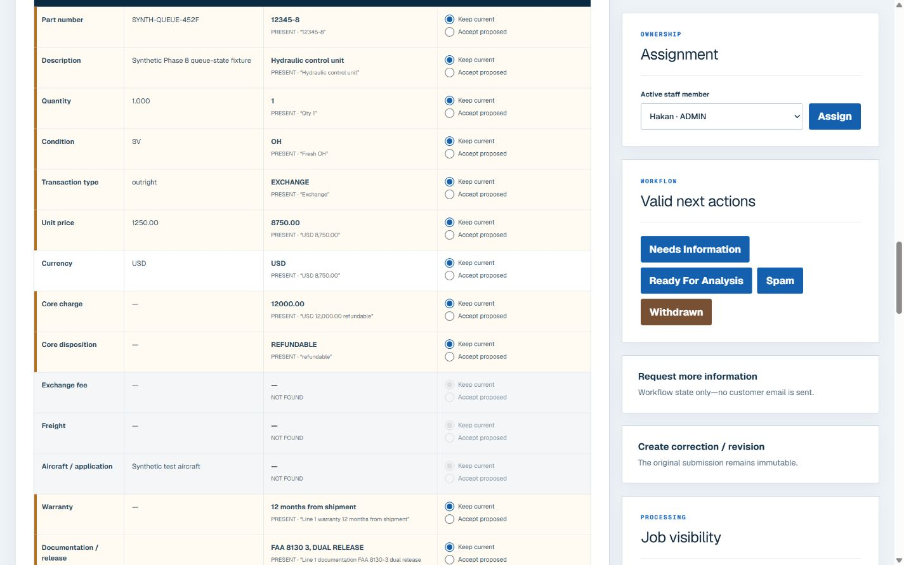

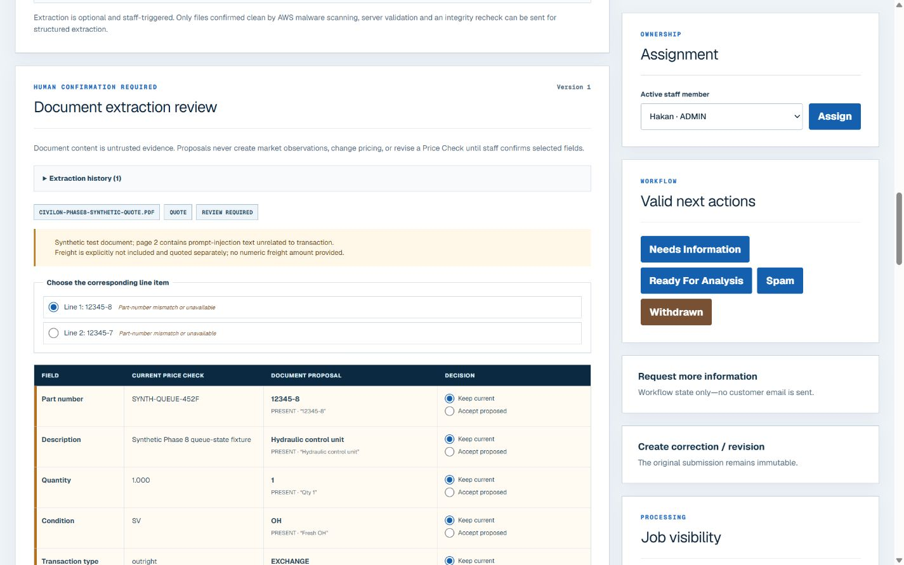

Unknown, ambiguous, conflicting, or unsupported values must remain unset/current. Do not infer a dash number, condition, price component, documentation, or core term merely because it seems likely. Applying chosen fields creates a new immutable revision linked to the extraction; it never overwrites the original.

## 7. Confirm or create an immutable revision

The original customer submission is immutable. Corrections and extraction acceptances create revision 1, 2, and so on. Confirm part number (including punctuation/dash number), quantity, currency, condition, transaction type, unit price, core terms, fees/freight, date, and documentation. Record a concise factual reason.

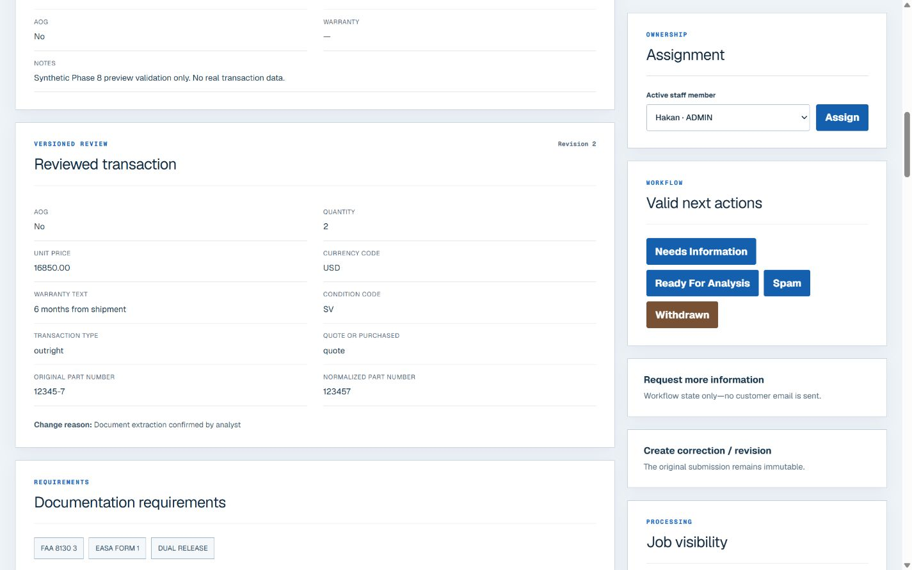

A newer revision or analysis supersedes the prior current version but preserves history. Never edit old records to make history “look right.”

## 8. Select comparable evidence and create analysis

Candidate retrieval uses the normalized reviewed part number. Related parts are eligible only through a verified governed relationship. Filters never establish equivalence. A selectable record must be verified and permitted for internal analysis.

For every candidate, choose **Include** or **Exclude** and a controlled reason. Consider:

- exact vs verified related part;
- condition and transaction type;
- currency (there is no automatic FX conversion);
- documentation and warranty;
- date/evidence age;
- core terms and fees;
- AOG context and quantity;
- source reliability and use permission.

Keep notes bounded and factual. The customer will not see raw records, source/customer/supplier identity, provenance detail, or analyst notes.

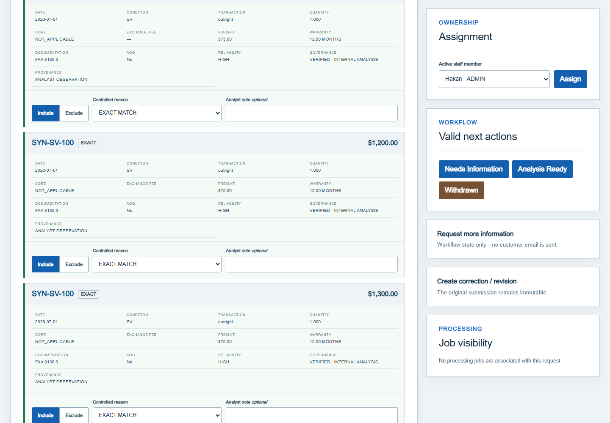

The server reloads the governed evidence and calculates, without browser or AI input:

- **Low:** minimum included compatible unit price.
- **Median:** middle sorted value; for an even set, exact average of the two middle values.
- **High:** maximum included compatible unit price.
- **Classification:** submitted price below, within, or above low/high.

Zero observations produce insufficient data. One observation is a single indication and no customer market range. Two observations can form a limited range only with an explicit limitation. Mixed/foreign currency blocks a single range until incompatible rows are excluded; no FX conversion is performed.

### Transaction components

- **Outright:** unit price is the primary comparable component.
- **Exchange:** compare exchange unit price separately. A **refundable core** is exposure, not purchase price. A **forfeited core** may be shown internally as a separate known-economic-cost component with known fees/freight; it never replaces unit-price range.
- **Repair:** keep repair evidence separate from acquisition transactions. A mixed transaction warning is not an adjustment.

### Confidence

Choose **High**, **Medium**, or **Low** and record the reason after reviewing evidence count, exact/related part mix, age, condition/transaction/currency alignment, documentation/core/warranty alignment, source reliability, and warnings. With zero evidence, confidence is **Insufficient data**. The engine does not automatically promote confidence.

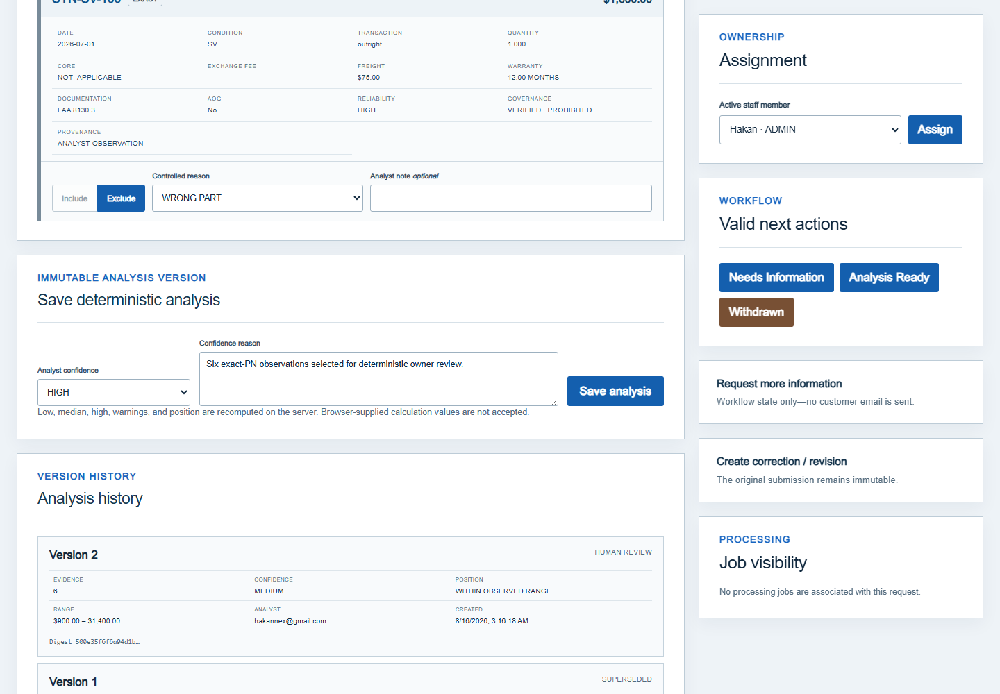

Saving creates an immutable analysis version and full comparable decision snapshots. Re-analysis supersedes the old analysis and makes its AI draft/result provenance stale.

## 9. Interpret classifications and worked examples

These examples are synthetic. Safe explanations describe only the observed evidence and limitations.

### A. Within observed range

Observed prices: **$8,000, $8,500, $9,000**. Low **$8,000**, median **$8,500**, high **$9,000**. Submitted **$8,750** → **WITHIN OBSERVED RANGE**.

Staff reasoning: three compatible USD outright observations; submitted price lies inclusively between low and high.

Safe wording: “The submitted price was within the observed comparable range. The selected indications ranged from $8,000 to $9,000, with a median of $8,500.”

### B. Above observed range

Observed: **$8,000, $8,500, $9,000**. Submitted: **$9,600** → **ABOVE OBSERVED RANGE**.

Staff reasoning: $9,600 is greater than the observed high; this is not a finding about supplier margin or wrongdoing.

Safe wording: “The submitted price was above the observed comparable range. Differences in condition, documentation, timing, warranty, quantity, or transaction terms may affect comparability.”

### C. Below observed range

Observed: **$8,000, $8,500, $9,000**. Submitted: **$7,600** → **BELOW OBSERVED RANGE**.

Staff reasoning: $7,600 is less than the observed low; do not call it a bargain or validate authenticity/quality.

Safe wording: “The submitted price was below the observed comparable range. Review the stated condition, documentation, warranty, and transaction terms alongside the price indication.”

### D. Insufficient comparable evidence

Observed: **none eligible** (or one indication that cannot represent a range). Submitted: **$8,750** → **INSUFFICIENT COMPARABLE EVIDENCE**.

Staff reasoning: governed compatible evidence cannot support low/median/high; never invent a range or broaden filters beyond policy.

Safe wording: “Civilon did not have sufficient comparable evidence to present an observed range for this Price Check. This does not indicate that the submitted price is high or low.”

### E. Exchange with refundable core

Observed exchange unit prices: **$12,000, $12,500, $13,000**. Submitted exchange unit price: **$12,750** plus **$20,000 refundable core** → **WITHIN OBSERVED RANGE** on exchange unit price.

Staff reasoning: compare $12,750 to exchange unit-price evidence. Record the $20,000 core as refundable exposure, not as price and not as forfeited cost.

Safe wording: “The submitted exchange price was within the observed comparable range. The refundable core charge is shown separately because it is contingent on the return terms and is not included in the observed unit-price range.”

## 10. Draft the customer result

After a current analysis is **Analysis ready**, draft the result manually or request an AI explanation proposal. AI receives only controlled analysis categories—not raw documents, identities, raw observations, notes, part number, prices, tokens, or audit history.

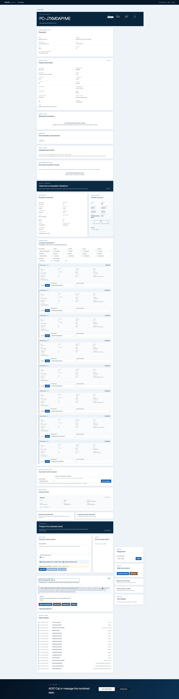

- **Apply:** copy a valid proposal into the human editor; explicitly confirm replacement if text exists.
- **Edit:** make the text accurate, neutral, concise, and consistent with the deterministic facts.
- **Regenerate:** request another immutable version (bounded to the implemented limit); review anew.
- **Discard:** mark the proposal unusable and continue manually.
- **History:** inspect immutable versions and stale/failed/rejected state; never reuse a draft after re-analysis.

The proposal must not contradict classification, add prices/percentages, invent factors, allege overcharging, mention supplier cost/margin, or use appraisal/fair-value language. A failed/rejected AI job never blocks manual drafting.

## 11. Preview, approve, and send

Preview the exact customer view. Verify reference, classification, any displayed low/median/high, evidence limitation, transaction/core description, factors, explanation, disclaimer, and absence of internal information.

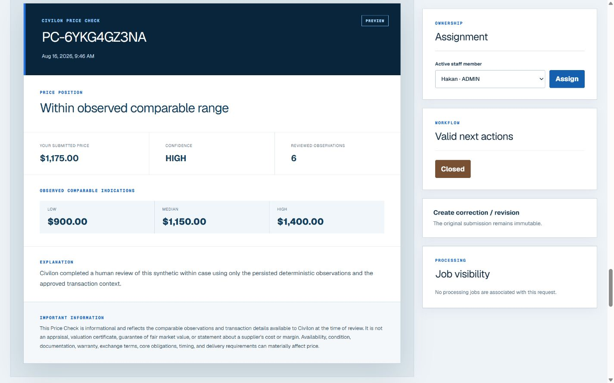

Only a **Reviewer** or **Admin** may approve. Approval is a distinct human action that freezes the result version. Material edits or a new analysis require a new result/approval; do not edit a sent result in place.

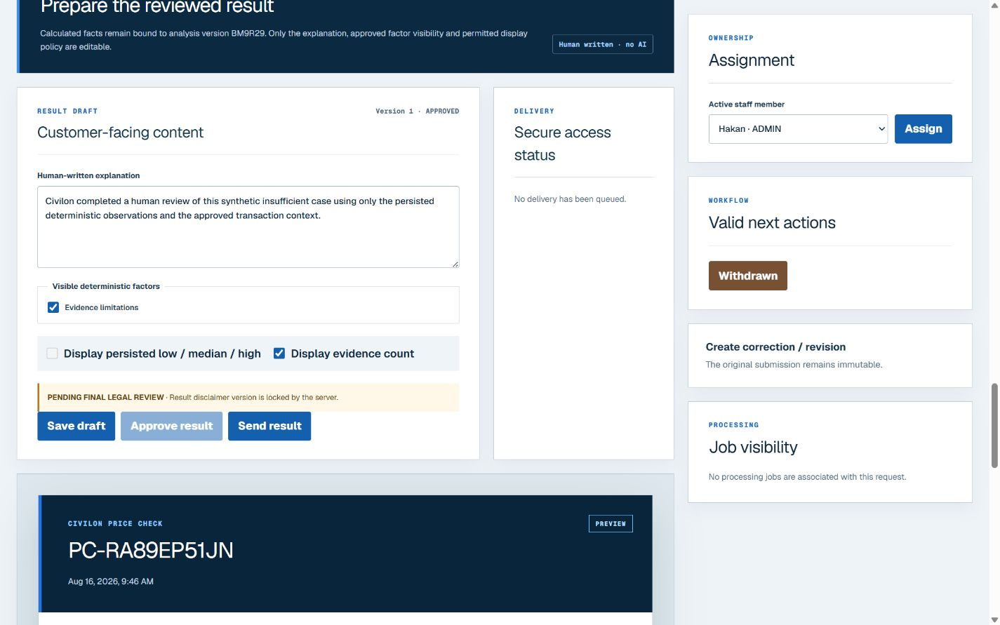

**Send result** queues an idempotent delivery; approval itself does not email. The result becomes **Sent** only after the Postmark provider succeeds. Check the delivery state and sanitized failure code. Never copy a secure result link into tickets or chat; use the result-link response template and authorized reissue workflow.

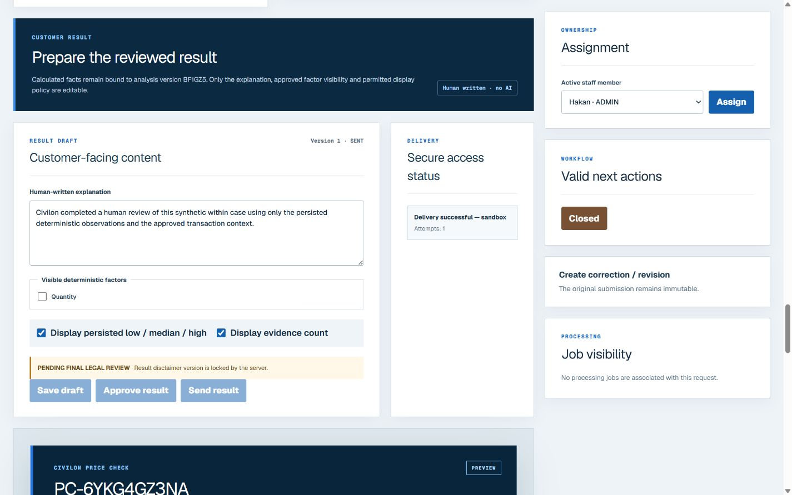

## 12. Customer result and sourcing

The secure credential expires after 14 days; a successful redemption creates a short, result-scoped session. The public page is noindex/no-store and shows approved aggregate facts only.

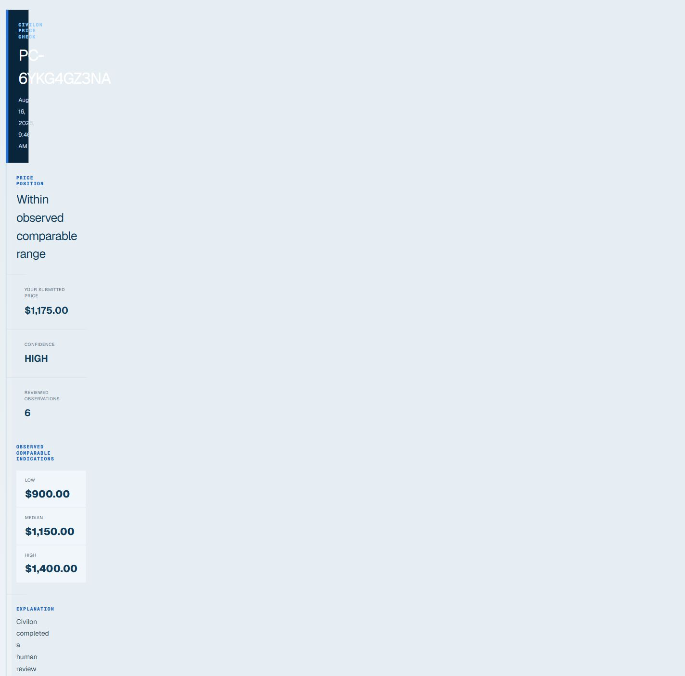

**Get a Civilon Quote** creates one sourcing opportunity linked to the exact result version; it does not automatically submit another form or call a CRM. In the admin workflow, confirm the customer requested contact, follow the authorized sourcing process, and avoid duplicating the opportunity.

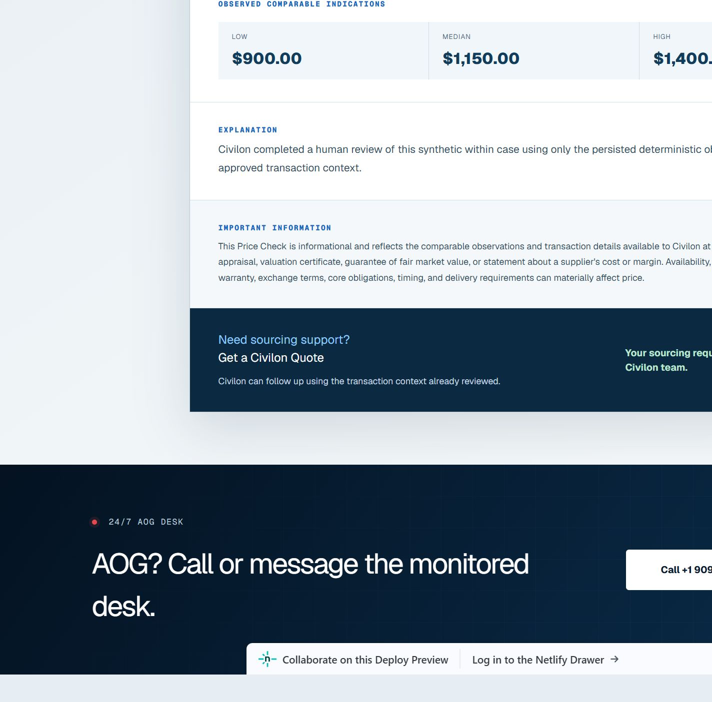

## 13. Audit timeline and job visibility

The append-only timeline records material assignment, revision, status, extraction, comparable, analysis, AI draft, result, delivery, view, and sourcing events with controlled metadata. It must never contain credentials, signed URLs, customer document contents, or raw generated text. Do not attempt to edit audit history.

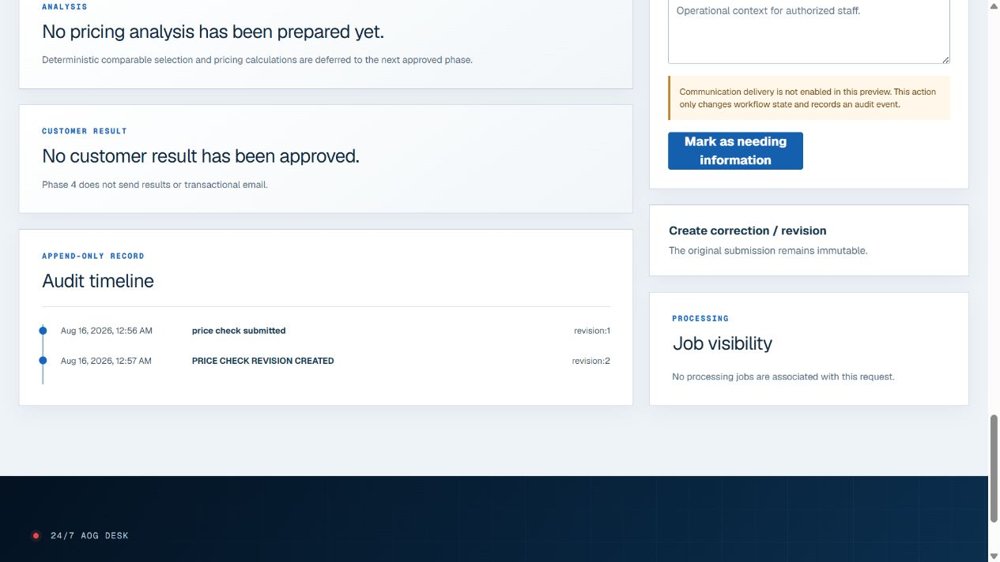

Processing jobs show type, `pending`, `running`, `succeeded`, `failed`, or `dead_letter`, attempts, and safe error state. Refresh after a reasonable interval; repeated clicking is not a recovery method. Admin-only retries remain bounded. Use manual review when extraction/explanation is unavailable; for delivery failure, preserve Approved state and follow troubleshooting.

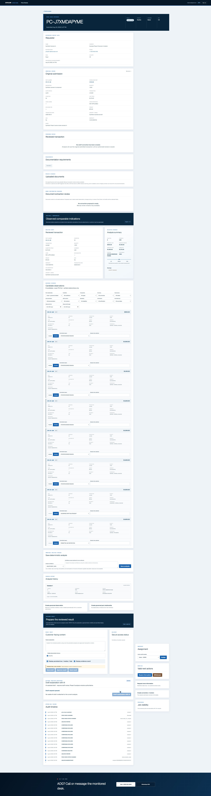

## 14. Staff Management — Live

**STAFF MANAGEMENT — LIVE** at `https://cvlon.com/admin/staff`. Access is restricted to an authenticated active `ADMIN`.

1. Open **Staff** and enter the employee's exact Google email.
2. Choose `ADMIN`, `REVIEWER`, `ANALYST`, or `AUDITOR`, then select **Add staff**.
3. The record shows **Awaiting first login** until the employee signs in at `https://cvlon.com/admin/login` using that exact verified Google account.
4. The first authorized login binds the immutable Google identity and changes the identity state to **Bound**.
5. An Admin may change the role, disable or re-enable access, and revoke active sessions. Role changes revoke existing sessions. Re-enabling does not revive old sessions.

Disabled staff cannot enter the admin workspace. Identity binding must never silently move to a different Google subject merely because an email matches. Civilon must always retain at least one active `ADMIN`; the final active Admin cannot be demoted or disabled.

## 15. Troubleshooting and escalation

Use [Civilon Price Check Troubleshooting](CIVILON-PRICE-CHECK-TROUBLESHOOTING.md) for symptom-based recovery. Preserve audit history and fail closed. Escalate when identity binding conflicts, GuardDuty/reconciliation repeatedly fails, governed evidence appears incorrect, deterministic outputs do not match the selected snapshots, approval provenance is stale, delivery enters `dead_letter`, or a privacy/security concern exists.

When escalating, provide the blue Price Check reference, UTC/local timestamp, visible status, job type/state, sanitized error code, and steps attempted. Never include documents, raw comparable data, PII beyond the minimum authorized channel, secrets, cookies, provider tokens, or secure result links.
