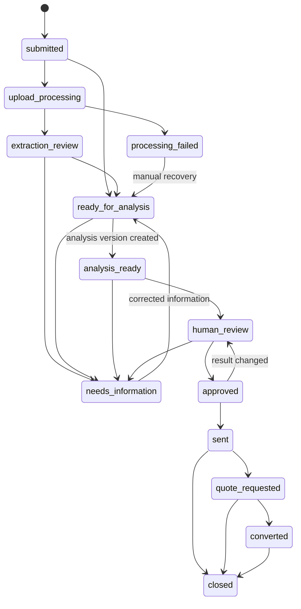

# Civilon Price Check — Admin Workflow

Status: planning only

## 1. Admin goals

The admin workspace is an operational review system, not a raw database editor. It must make the safe path the easy path: verify the request, resolve extraction differences, select evidence, review deterministic calculations, edit the explanation, approve, send, and preserve a complete audit history.

No Phase 1 customer result is sent without a reviewer approval action.

## 2. Roles and separation of duties

| Role | Capabilities |
|---|---|
| Analyst | Triage, request information, correct normalized data, select/exclude comparables, run analysis, edit drafts |
| Reviewer | Analyst capabilities plus approve, return for changes, and send approved results |
| Admin | User/role activation, assignments, policy/configuration, retention actions, operational recovery |
| Auditor | Optional read-only access to approved records and audit history |

For a small initial team, an authorized reviewer may also be the analyst, but the UI still requires an explicit approval step and records both actions. High-risk actions require recent authentication.

## 3. Queue

Default queue columns:

- reference and submitted time;
- requester and company, masked or permission-limited where appropriate;
- part number, condition, and broad transaction type;
- quoted unit price and currency;
- AOG indicator;
- processing/status badge;
- extraction warning count;
- deterministic classification and confidence/evidence sufficiency;
- AI draft state, clearly labelled as assistance rather than the price authority;
- assignee;
- age/SLA indicator only after an operational target is approved.

Filters:

- status, AOG, assignee, age, condition, transaction type;
- upload/scan/extraction state;
- evidence sufficiency;
- needs-information and processing-failed flags.

Search supports reference, normalized part number, and authorized requester/company lookup. Mask email/phone in lists, avoid supplier identity, and audit sensitive searches/exports as appropriate.

## 4. Request detail workspace

Recommended sections:

1. **Triage header:** status, AOG, assignee, reference, age, next permitted action.
2. **Requester:** protected contact data and privacy/consent state.
3. **Submitted transaction:** immutable original values.
4. **Reviewed transaction:** normalized current revision and correction history.
5. **Documents:** scan state, safe preview, extraction proposals, field-by-field differences.
6. **Comparable evidence:** searchable candidate observations, inclusion/exclusion reasons, provenance/reliability indicators.
7. **Calculation:** deterministic components, selected-set summaries, confidence dimensions, insufficiency flags, engine/policy version.
8. **Customer result:** structured result preview, editable explanation, disclaimer version, approval checks.
9. **Communication:** request-information messages, delivery status, quote request.
10. **Audit timeline:** actor, action, version, and timestamp.

Never display signed object URLs longer than needed. Avoid offering bulk raw observation exports in the MVP.

## 5. Status model

Business status is separate from background-job status.

Terminal/exception statuses such as `spam` or `withdrawn` require a reason and appropriate permissions. A correction after approval creates a new revision/result and returns to `human_review`; it does not edit the sent result in place.

Background jobs use `pending`, `running`, `succeeded`, `failed`, and `dead_letter`. A failed job does not silently redefine the business status.

## 6. Triage workflow

1. Claim or assign the request.
2. Confirm spam/duplicate/idempotency state.
3. For AOG, verify callback availability and follow the approved urgent-contact process.
4. Review scan and extraction states; manual entry remains usable if extraction failed.
5. Compare submitted and extracted values field by field.
6. Accept, reject, or correct each material proposal with a reason.
7. Request missing information without exposing internal analysis.
8. Mark the reviewed transaction ready for analysis.

Request-information links should use an authenticated or one-time verified correction flow. Email replies must not become the sole system of record; the final correction is entered as a versioned revision.

## 7. Comparable and analysis workflow

Candidate observations are retrieved deterministically from exact part, governed part relationships, condition, transaction type, date, and permitted-use fields. The analyst can broaden or narrow the candidate set but must choose a reason.

For every candidate:

- show provenance/reliability and verification state;
- show like-for-like differences in condition, transaction type, core, documentation, warranty, date, quantity, currency, freight, and AOG context;
- include/exclude with a controlled reason and optional note;
- prevent use when permission or verification state is invalid.

Running analysis creates a new immutable version. The UI displays source components and calculation steps so the analyst can reproduce the output. It must block publishable conclusions when evidence is insufficient, currency conversion lacks provenance, core terms are unresolved, or incompatible transaction types have been combined.

After deterministic analysis, an analyst may generate or regenerate an AI explanation draft. Every draft remains versioned and auditable, and regeneration never changes comparable membership, calculation values, confidence, or classification.

## 8. Result review and approval

Approval checklist:

- reviewed transaction values are confirmed;
- included evidence is permitted, verified, and comparable;
- exclusions/reasons are complete;
- deterministic summaries and confidence agree with the selected set;
- AI draft contains no unsupported number, supplier claim, accusation, or invented fact;
- factor list includes only factors used;
- informational disclaimer/version is present;
- no requester, supplier, or observation identity leaks into the result;
- CTA is distinct from the informational conclusion.

Approval records the result content digest, analysis version, reviewer, timestamp, and checklist version. Changing a material result field invalidates approval.

Sending is an explicit action after approval. It creates an outbox item and token, then records provider delivery state. A delivery failure keeps the result approved but unsent/retryable.

## 9. Customer correction and sourcing conversion

### Correction

1. Authenticate the requester through the approved secure flow.
2. Record the correction as a new transaction revision.
3. Mark prior analysis/result superseded, not deleted.
4. Re-run deterministic analysis and human review.
5. Revoke the old result token when the new result is sent.

### Civilon quote request

The result CTA creates a separate `sourcing_opportunity` linked to the Price Check. It does not alter the approved conclusion and does not post into the existing `quick-rfq` Netlify Form. The customer sees a clear confirmation; internal owners can track conversion without exposing transaction detail to external analytics.

## 10. Administrative controls

Admin-only actions:

- activate/deactivate staff and assign roles;
- reassign requests;
- retry/dead-letter operational jobs;
- revoke/reissue result access;
- approve retention deletion/pseudonymization;
- manage versioned policy/configuration only after change review;
- export narrowly scoped, audited data when explicitly authorized.

No UI should permit editing audit events, changing an approved analysis version, bypassing evidence permission, or converting a customer submission into an observation without the explicit governance workflow.

## 11. Accessibility and operational quality

- Logical heading and landmark structure with one main landmark.
- Queue and tables usable by keyboard and screen reader; mobile may use labelled cards without losing field relationships.
- Status never conveyed by color alone.
- Visible focus, skip link, descriptive controls, error summaries, and field-level errors.
- Dialog focus containment/return and a non-dialog alternative for complex work.
- Safe document preview with text fallback and zoom; extracted source references must not depend on visual highlighting alone.
- Unsaved-change protection and conflict detection for concurrent reviewers.
- Dates in the user's locale for display, UTC in storage, explicit source time zone where relevant.

## 12. Admin acceptance criteria

- An analyst can complete a no-upload manual case without AI.
- A failed scan, extraction, AI call, or email does not lose or corrupt the request.
- Original, extracted, reviewed, calculated, drafted, approved, and sent values remain distinguishable.
- Unauthorized roles cannot read or mutate protected data, including through direct API calls.
- Every material action produces an audit event.
- A correction produces a new version and invalidates prior approval.
- No result can be sent without approval.
- The same outbox job cannot send duplicate email under retry.
- Keyboard-only users can complete every core workflow.
