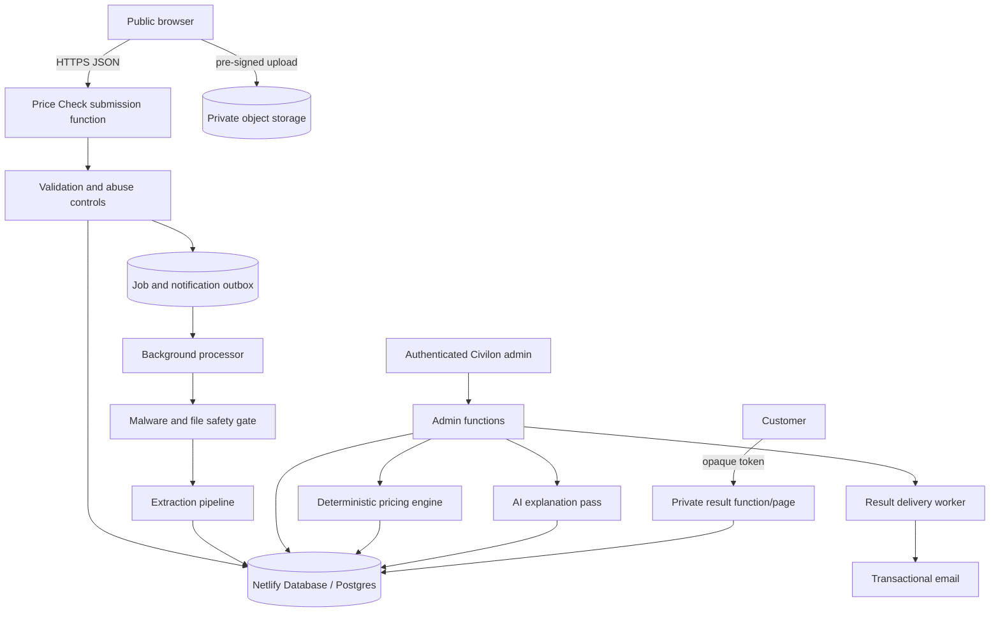
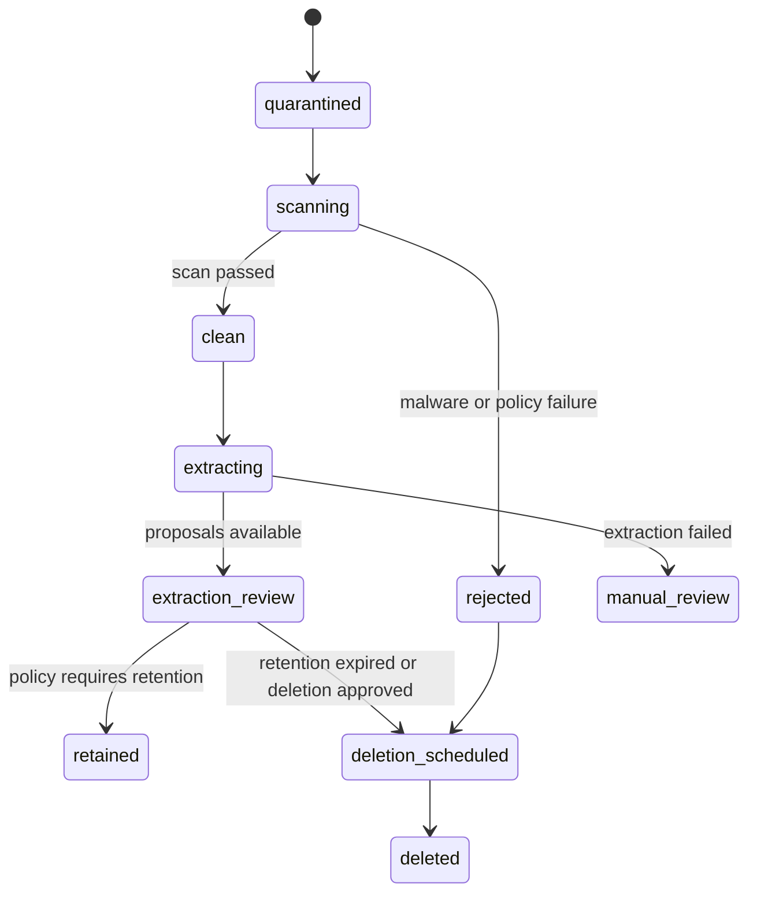

# Civilon Price Check — Technical Architecture

## 1. Existing architecture findings

The frozen site currently uses:

- React 19 and the Next-compatible App Router through Vinext;
- Vite for builds;
- a Netlify-specific Nitro preset when `CIVILON_NETLIFY_BUILD=true`;
- static public assets and server-rendered routes in `app/`;
- a client-side `quick-rfq` component that posts URL-encoded data to the static Netlify Forms blueprint at `public/netlify-form.html`;
- an approved-host gate for existing RFQ submission;
- a small, privacy-conscious first-party analytics wrapper;
- canonical and indexing behavior controlled by `NEXT_PUBLIC_SITE_URL` and `NEXT_PUBLIC_ALLOW_INDEXING`;
- Drizzle packages already installed, but only an unused Cloudflare D1/SQLite starter configuration;
- no active database, upload store, application API, admin authentication, or background job system.

The Cloudflare worker and D1 files support a separate local/Sites path. `.openai/hosting.json` has no D1 or R2 binding. They must not be treated as the production Netlify database architecture.

### Consequences for Price Check

1. Do not reuse Netlify Forms for Price Check. The feature needs transactional database writes, attachment state, analysis versions, authorization, and audit history.
2. Do not modify `quick-rfq`, `netlify-form.html`, AOG serialization, or current submission-host behavior.
3. Put secrets and privileged operations in server-side Netlify Functions, not client components or build-time public variables.
4. Treat the current Drizzle D1 configuration as inactive starter code. The implementation should deliberately migrate the application database layer to Postgres or create an explicit Price Check Postgres configuration without creating two ambiguous `getDb()` paths.
5. Validate Vinext/Nitro route behavior with Netlify Functions in an early spike before building product UI.

## 2. Recommended target architecture

Use Netlify Database managed PostgreSQL with Drizzle ORM, private object storage, server-side Netlify Functions, a transactional email provider, and an asynchronous job/outbox pattern.

Netlify Database is a managed Postgres service with deploy-context branching and migration integration. Its current documented Drizzle path uses `drizzle-orm/netlify-db`, Postgres schema definitions, and migrations under `netlify/database/migrations/`. Confirm the exact adapter and Drizzle version in the implementation spike because the repository currently pins Drizzle `0.45.2` while current Netlify guidance may require a newer/beta adapter. See [Netlify Database](https://docs.netlify.com/build/data-and-storage/netlify-database/) and [Netlify Database tooling](https://docs.netlify.com/build/data-and-storage/netlify-database/tooling/).

## 3. Runtime boundaries

### Browser

The browser may:

- render the public page and form;
- validate for usability, never as the sole validation layer;
- request an upload authorization;
- upload directly to a private store with a narrow, short-lived signed request;
- submit confirmed transaction and requester data;
- render a private result returned by an authorized server route;
- emit non-sensitive analytics events.

The browser must never receive database credentials, object-store secrets, email credentials, OpenAI keys, internal observation data, analyst notes, raw comparable rows, or admin authorization policy.

### Netlify Functions

Recommended function surfaces:

- `POST /api/price-check/uploads/authorize`
- `POST /api/price-check/submit`
- `GET /api/price-check/result/:token`
- `POST /api/price-check/result/:token/quote-request`
- private `/api/admin/price-checks/*` routes
- background processing functions for scan, extraction, analysis preparation, and notification delivery

Use route names as design intent; final paths should be tested against the Vinext/Nitro and Netlify Functions routing behavior.

Function environment variables must be configured in Netlify with Functions scope where available. Netlify documents that values declared only in `netlify.toml` are not automatically available to functions. See [Netlify function environment variables](https://docs.netlify.com/build/functions/environment-variables/).

### Database

All business writes occur in transactions. Submission acceptance should atomically create the requester association, price check, documentation selections, attachment associations already uploaded, initial status, and immutable audit event. Follow-on processing uses idempotency keys and versioned records rather than in-place replacement of historical analysis.

### Background work

Long-running or retryable tasks must not extend the customer submission response:

- malware scan;
- PDF/image normalization;
- extraction;
- notification delivery;
- AI calls;
- result generation and delivery.

Phase 1 can use Netlify Background Functions plus a Postgres outbox/lease table. If operational volume or scheduling needs outgrow that model, replace the worker transport without rewriting domain tables.

## 4. Submission architecture

1. Browser requests a short-lived upload authorization, if needed.
2. Server validates file count, expected size, declared MIME, session nonce, and rate-limit budget.
3. Browser uploads into a quarantine prefix; it cannot choose arbitrary object keys or read other objects.
4. Browser submits confirmed fields plus opaque attachment IDs and an idempotency key.
5. Server performs schema validation, normalization, bot controls, and attachment ownership checks.
6. Server writes the request and returns a human-readable reference immediately.
7. Scan/extraction/notification tasks run asynchronously.
8. AI or email failure never rolls back the accepted request.

Return `202 Accepted` when processing remains, not a false completed-analysis response.

### Idempotency and duplicates

- Require a random client submission idempotency key.
- Enforce a unique scoped hash in Postgres.
- Return the prior accepted reference for a safe retry with an identical authenticated/session scope.
- Flag likely business duplicates using normalized part number, requester, transaction price/currency, and a configurable time window; do not automatically discard them.

## 5. Object storage and uploads

Do not store binary files in Postgres.

Preferred architecture is a private S3-compatible object store with:

- pre-signed upload requests;
- server-generated opaque object keys;
- encryption at rest;
- no public bucket listing or anonymous read;
- quarantine and clean prefixes/buckets;
- lifecycle expiration;
- object versioning or retention appropriate to policy;
- malware scanning integration;
- access logs;
- deletion support;
- region and data-processing terms approved by Civilon.

AWS S3 or a compatible service such as Cloudflare R2 can satisfy this shape. Netlify Blobs may be evaluated, but should be selected only if its current private-access controls, file-size behavior, lifecycle management, and malware-scanning integration meet the policy. This is an owner/vendor decision, not an implementation assumption.

### File-processing pipeline

Controls:

- verify magic bytes and parseability server-side;
- reject encrypted/password-protected PDFs in MVP unless a safe process is approved;
- cap page count, pixel dimensions, decompressed size, and processing time;
- rasterize/parse in an isolated, patched worker with no broad network access;
- strip active content and never execute embedded scripts, macros, links, or attachments;
- create a cryptographic digest for duplicate detection and audit;
- serve downloads only through short-lived authorized URLs;
- use sanitized display filenames separate from object keys.

## 6. Deterministic pricing engine

The pricing engine—not the language model—owns comparable selection facts, normalized transaction components, ranges, counts, confidence inputs, and classification policy.

### Phase 1 responsibilities

1. Normalize part-number casing and punctuation while preserving original and dash-number boundaries.
2. Keep distinct sets for exact match, recognized supersession/equivalence, and analyst-approved related application.
3. Partition comparables by transaction type and condition.
4. Present core, exchange fee, freight, warranty, documentation, date, AOG, quantity, and source-reliability differences explicitly.
5. Calculate reproducible descriptive summaries for the analyst-selected like-for-like set.
6. Store included/excluded comparable IDs and reasons.
7. Store the engine/policy version and all calculation inputs.
8. Prevent publication when required inputs are unresolved or evidence is insufficient.

### Price representation

Store source amounts and currency exactly. A normalized currency value may be added only with an approved FX source, rate date, and reproducible conversion record.

Do not flatten transaction economics into one misleading number:

- outright unit price can be shown with separately allocated freight/fees;
- exchange price and exchange fee remain distinct;
- refundable core exposure is not automatically treated as consumed cost;
- forfeited/non-returnable core may be represented as cost only when known;
- repair transactions remain separate from outright/exchange observations;
- taxes and duties remain separate unless policy explicitly includes them.

Median, low, and high should describe the selected evidence set. Do not imply statistical precision when the set is small or heterogeneous. Phase 1 may show the individual comparable context to analysts while suppressing a customer range for insufficient evidence.

### Evolution toward automation

As data grows:

- establish a governed equivalence/supersession graph;
- validate categorical reliability policy against reviewed outcomes;
- introduce configurable recency windows by component family;
- define tested like-for-like inclusion rules;
- backtest proposed classifications against analyst decisions;
- shadow-run automation before exposing it;
- version every rule and retain reproducibility.

No numeric confidence or classification threshold becomes production policy without an evaluated dataset and business approval.

## 7. Confidence model

Output categories:

- `high`
- `medium`
- `low`
- `insufficient_data`

Evidence dimensions:

- comparable count;
- recency;
- exact part/dash match;
- condition match;
- transaction-type match;
- documentation comparability;
- source reliability and verification;
- warranty and core clarity;
- currency normalization quality;
- quantity and AOG context;
- unresolved contradictions.

Phase 1 records categorical assessments and analyst reasoning. High confidence does not bypass human review until Phase 2 policy is separately approved. Low or insufficient confidence always requires human review and may suppress an automatic range.

## 8. Admin authentication and authorization

Recommend managed OIDC authentication using Civilon's Google Workspace identities, with MFA enforced by the identity provider. Keep the provider behind an auth adapter so the domain model does not depend on one vendor.

Minimum roles:

- `analyst`: review requests, edit normalized data, select comparables, draft results;
- `reviewer`: analyst permissions plus approve and send;
- `admin`: manage users, policies, assignments, retention actions, and operational settings;
- `auditor` (optional): read-only history and reports.

Controls:

- server-side session verification on every admin request;
- explicit user allowlist and active flag, not email-domain trust alone;
- short sessions and reauthentication for sensitive exports/deletions;
- CSRF protection for cookie-authenticated mutations;
- least-privilege database access;
- no raw database admin UI as the business interface;
- immutable audit events for authentication-sensitive actions;
- deny-by-default authorization tests.

The repository's optional ChatGPT identity helper is specific to the separate Sites hosting environment and does not establish Civilon staff membership. It should not be used as Netlify admin authentication.

## 9. Transactional email

Use a dedicated transactional provider and an outbox table. Do not reuse Netlify Forms notification rules.

Email types:

- customer submission acknowledgment;
- customer request-more-information;
- customer result-ready;
- optional Civilon Buy Request conversion and sourcing follow-up;
- internal new Price Check;
- internal AOG Price Check;
- internal analysis-ready-for-review.

The database transaction writes an outbox row. A worker sends and records provider message ID, attempt count, redacted error, and timestamps. Retries are exponential and idempotent. An email outage does not lose the request or approve a result.

Avoid part number, price, supplier, or sensitive aircraft data in email subject lines. Prefer the human-readable Price Check reference.

## 10. Observability

Track without logging sensitive payloads:

- request acceptance and validation outcome;
- processing job state and duration;
- upload scan state;
- extraction schema-valid/invalid outcome;
- pricing-engine version and success/failure;
- AI request correlation, model configuration key, token/cost metadata where permitted, and schema-valid outcome;
- email delivery state;
- admin action audit ID;
- rate-limit and abuse decisions.

Use correlation IDs distinct from customer-visible tokens. Redact headers, form bodies, document text, signed URLs, PII, prices, and API keys from logs.

## 11. Failure behavior

| Failure | Customer behavior | Internal behavior |
|---|---|---|
| Unknown/typo part number | Accept; ask for confirmation or analyst review | Flag normalization uncertainty |
| No comparables | Accept; no automatic conclusion | Human review/insufficient data |
| One comparable | Accept; do not imply a market range | Analyst decides whether it is useful context |
| Mixed conditions | Keep sets separate | Analyst may select/exclude with reasons |
| Unclear core/exchange | Ask for information or show scenarios | Prevent automatic classification |
| Multiple currencies | Store source values | Convert only with approved FX provenance |
| Old quote | Accept and label date/age | Lower confidence or manual review |
| Missing documents | Accept | Record limitation; do not imply applicable docs |
| Corrupted/unsupported file | Preserve manual request | Reject attachment and request replacement |
| AI extraction failure/outage | Submission still succeeds | Manual extraction queue and retry |
| Database outage | Do not claim acceptance | Safe retry message; no email-only fallback as system of record |
| Duplicate request | Return idempotent result or flag | Never double-send/duplicate observations |
| Spam | Generic acceptance policy as appropriate | Quarantine and restrict processing |
| Customer correction | Create new version | Re-run analysis and preserve prior history |
| Email outage | Show accepted reference | Outbox retry; admin alert |

## 12. Compatibility spike exit criteria

Before feature UI implementation, prove on an isolated deploy preview:

1. Netlify Database can be provisioned in the intended account/plan without touching production.
2. The chosen Drizzle versions work with `drizzle-orm/netlify-db`.
3. Postgres migrations run only against the correct deploy-context branch.
4. A Netlify Function can validate, write, read, and transactionally roll back.
5. Runtime secrets remain function-only and absent from client bundles/build logs.
6. Background processing can lease and retry an outbox job idempotently.
7. Vinext routes, existing Netlify Forms, and the Nitro build remain unchanged.
8. Local integration tests can use a disposable Postgres-compatible database.

No production service should be provisioned during the planning stage.
