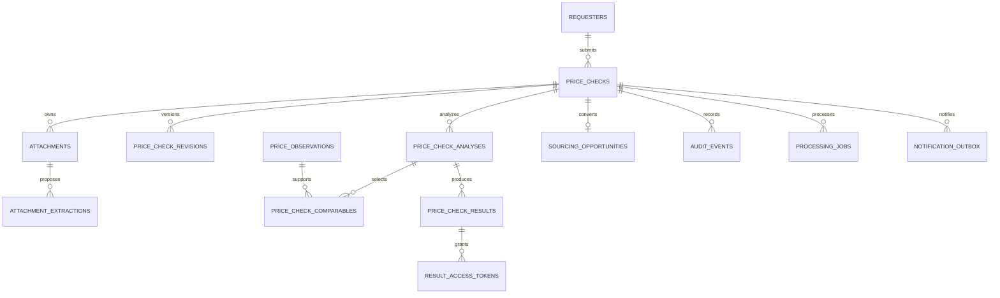

# Civilon Price Check — Data Model

Status: planning only

Database recommendation: managed PostgreSQL through Netlify Database

ORM recommendation: Drizzle, subject to the compatibility spike

## 1. Design principles

- Keep customer identity, transaction facts, proprietary observations, analysis, and delivery state separate.
- Preserve the original submitted values and store normalized values alongside them.
- Use append-only versions for extraction, analysis, result, and correction history.
- Store money as fixed-precision numeric values plus an ISO 4217 currency code; never use floating point.
- Store attachment bytes outside Postgres. The database contains metadata, ownership, scan state, and retention state only.
- Treat customer submissions as customer evidence, not as Civilon pricing observations. An authorized analyst must explicitly promote a verified, permitted, de-identified transaction into the observation dataset.
- Keep customer-facing references separate from database IDs and access tokens.
- Record the policy, engine, prompt, model, and schema versions needed to reproduce every approved result.

Use UUIDv7 or ULID identifiers for internal primary keys and a separately generated non-sequential reference such as `PC-8H4K2Q`. The display reference is not an authorization credential.

## 2. Core entities

### `requesters`

Purpose: service-contact identity and operational consent.

Key fields:

- `id`
- `first_name`, `last_name`, `company_name`, `business_email`, `phone`, `role`, `country`
- `service_processing_acknowledged_at`
- `marketing_consent_at` nullable and separate
- `created_at`, `updated_at`, `deletion_requested_at`, `deleted_at`

Normalize email and phone for duplicate detection in separate protected columns. Do not use requester PII as an external analytics identifier.

### `price_checks`

Purpose: the system-of-record request and current workflow pointer.

Key fields:

- `id`, `public_reference`, `requester_id`
- `status`, `assigned_admin_user_id`
- original and normalized part number, description, quantity
- `quote_or_purchased`, `transaction_type`, `condition_code`
- `unit_price`, `currency_code`
- core, exchange, freight, warranty, transaction-date, aircraft/model, AOG, and notes fields
- `source_page`, sanitized attribution fields, `idempotency_hash`
- `current_analysis_id`, `current_result_id`
- `submitted_at`, `created_at`, `updated_at`, `closed_at`

Use check constraints for allowed enums, positive quantities and amounts, three-character currencies, and AOG callback requirements. The server owns normalization and validation.

### `price_check_document_requirements`

Purpose: normalized many-to-many selections such as FAA 8130-3, EASA Form 1, dual release, OEM C of C, material certification, removal records, teardown/evaluation report, and test report.

Fields: `price_check_id`, `requirement_code`, optional sanitized `other_text`, and timestamps. Enforce uniqueness per request and code.

### `attachments`

Purpose: attachment ownership and safety lifecycle.

Key fields:

- `id`, `price_check_id`, `uploaded_by_type`
- sanitized display filename, object key, storage provider
- declared and detected MIME, byte size, digest
- scan state, scan provider/version, quarantine/clean state
- retention class, deletion due date, deleted timestamp
- created and updated timestamps

Never store a public object URL. Signed URLs are generated just in time and are not persisted in audit payloads.

### `attachment_extractions`

Purpose: immutable, versioned extraction proposals.

Key fields:

- `id`, `attachment_id`, `version`
- extraction schema version, model/provider configuration, prompt version
- structured proposal JSON, field-level source locations, uncertainty, warnings
- processing status, validation errors, created timestamp
- reviewer, reviewed timestamp, accepted/rejected state

JSONB is appropriate for a versioned extraction proposal, but values used by pricing are copied into explicit reviewed fields or a reviewed transaction revision. Extraction never overwrites the original submission.

### `price_check_revisions`

Purpose: customer or analyst corrections without destroying history.

Fields: `id`, `price_check_id`, `version`, normalized snapshot JSON, change reason, actor type/ID, source extraction ID if applicable, and timestamps. Core reportable fields may also be denormalized into columns if query volume justifies it.

## 3. Proprietary pricing evidence

### `price_observations`

Purpose: Civilon-authorized, governed observations used as possible comparables.

Key fields:

- `id`, provenance type, internal source reference
- original and normalized part number, dash-number/equivalence relationship
- condition, transaction type, quantity
- price components and source currency
- transaction/observation date
- documentation, warranty, core, freight, AOG, location-region context
- availability evidence and its observed timestamp, when genuinely known
- source reliability, verification state, permitted-use state
- de-identification state, created/reviewed by, timestamps

Supplier and customer identities, if business retention requires them, belong in a separately access-controlled provenance record. They are not exposed to the customer result or language model.

Controlled provenance types should initially support Civilon supplier quote, Civilon purchase, Civilon sale, customer supplier quote, customer completed purchase, analyst observation, licensed market-data source, and other authorized source. Each type still requires an independent reliability assessment, verification state, permitted-use basis, and source reference. A customer-entered price is never upgraded merely because it exists in a Price Check.

### `observation_documentation`

Purpose: documentation associated with an observation. Use the same controlled vocabulary as request requirements so comparison is deterministic.

### `part_relationships`

Purpose: analyst-governed exact, superseded, interchangeable, or related-application relationships.

Fields: from/to normalized part numbers, relationship type, direction, source/provenance, verification state, reviewer, effective dates, and notes. No relationship is inferred solely by a language model.

### `fx_rates`

Deferred until an approved source and policy exist. If implemented, store currency pair, rate, effective timestamp, provider, retrieval timestamp, license/provenance, and immutable version. Every converted value references the exact rate row.

## 4. Analysis and result history

### `price_check_analyses`

Purpose: immutable analysis version.

Key fields:

- `id`, `price_check_id`, `version`, input revision ID
- engine/policy version
- source and normalized transaction components
- summary low/median/high values and currency when publishable
- evidence count and categorical confidence
- classification, insufficiency reasons, factor codes
- deterministic calculation payload/digest
- AI draft ID nullable
- analyst/reviewer identities, review state, timestamps

### `price_check_comparables`

Purpose: the auditable evidence set for an analysis.

Fields: `analysis_id`, `observation_id`, included boolean, inclusion/exclusion reason code and analyst note, comparable snapshot, adjustments/normalization references, and sequence. A snapshot protects reproducibility if an observation is later corrected.

### `ai_artifacts`

Purpose: governed metadata and outputs from optional AI passes.

Fields: artifact type, related extraction/analysis ID, provider, model configuration, prompt/schema version, redaction policy version, request digest, structured response, validation state, token/latency metadata, error category, and timestamps.

Do not store raw API keys or unnecessary full prompts containing document text. Retention for raw model payloads must be shorter than durable approved business records.

### `price_check_results`

Purpose: approved customer-facing result versions.

Key fields:

- `id`, `price_check_id`, `analysis_id`, `version`
- approved classification, range/count display flags, factor list
- approved explanation and disclaimer version
- approved by/at, sent at, superseded at
- immutable rendered-content digest

### `result_access_tokens`

Purpose: revocable private result access.

Fields: `result_id`, keyed token hash, issued/expiry/revoked timestamps, maximum-use policy if adopted, last viewed timestamp, and view count. Store no plaintext token. Token lookup should use a rotating server-side HMAC key or a strong password-style hash appropriate to random bearer tokens.

## 5. Operations, authorization, and audit

### `admin_users`

Fields: external identity-provider issuer and subject, email for display, role, active flag, created/updated timestamps, last login, and deactivated timestamp. Authorization uses issuer/subject plus the local active allowlist, not email-domain matching alone.

### `processing_jobs`

Purpose: durable asynchronous work and retries.

Fields: job type, aggregate ID, idempotency key, state, attempt count, lease owner/expiry, next attempt, sanitized error code, created/started/completed timestamps. Enforce unique idempotency keys.

### `notification_outbox`

Purpose: transactional customer/internal email delivery.

Fields: message type, aggregate/result ID, recipient role reference, template version, state, attempt count, provider message ID, next attempt, timestamps, and redacted failure code. Avoid storing sensitive subject/body content when it can be deterministically rendered from an approved template.

### `audit_events`

Purpose: immutable security and business history.

Fields: event ID, aggregate type/ID, actor type/ID, action, before/after version references, request correlation ID, IP risk metadata where policy permits, sanitized structured metadata, and timestamp.

No update/delete permission should be granted to the normal application role. Retention and legal deletion should use a controlled archival/redaction process that records the action.

### `sourcing_opportunities`

Purpose: record a customer's explicit request for a Civilon sourcing quote without changing the existing `quick-rfq` contract.

Fields: `id`, `price_check_id`, requester ID, source result ID, status, assigned owner, created timestamp, and optional later CRM reference. Creating this row is an explicit action and an audited state change.

## 6. Relationships

## 7. Indexes and controls

Minimum indexes/constraints:

- unique `price_checks.public_reference` and `price_checks.idempotency_hash`;
- indexes on current status/assignee/submitted date and normalized part number;
- unique `(attachment_id, version)`, `(price_check_id, version)` for revisions/analyses/results;
- indexes on observation normalized part number, condition, transaction type, date, permitted-use, and verification state;
- unique `(analysis_id, observation_id)` comparable membership;
- unique access-token hash and an expiry index;
- partial indexes for runnable jobs, unsent notifications, active admin users, and non-deleted attachments;
- foreign-key restriction for evidence referenced by an approved result; use supersession, not deletion;
- timestamps stored in UTC, with customer-entered local dates/time zones stored explicitly when relevant.

Database roles should separate migrations, public submission, background processing, admin application, and read-only audit access. Public-facing functions never receive table-wide observation export permissions.

## 8. Retention and deletion design

Final periods require owner/counsel approval. The implementation must support independent schedules for:

- requester PII;
- transaction business records;
- uploaded originals and derived images/text;
- AI request/response artifacts;
- access tokens;
- approved results;
- de-identified observations with verified reuse permission;
- security/audit events.

A deletion request should revoke result tokens immediately, stop processing, schedule object deletion, remove or pseudonymize requester PII, and preserve only the minimum legally/business-required audit facts. A customer submission may become a durable observation only through a separate recorded permission and analyst-verification decision; deleting requester PII must not silently break evidence provenance.
