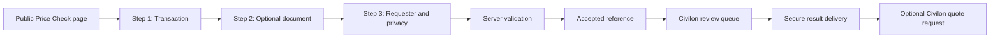

# Civilon Price Check — Product Requirements Document

Status: planning only

Source baseline: `4bfd837894d86d093ac07938c9749ae2a82db9e1`

Feature branch: `codex/civilon-price-check`

## 1. Product definition

**Product name:** Civilon Price Check

**Primary public route:** `/price-check`

**Primary H1:** Aircraft Part Price Check

**Primary proposition:** Before you approve the PO, check the market.

**Secondary proposition:** Did you pay a fair price for your aircraft part?

Civilon Price Check is an informational market-analysis service for aircraft-part transactions. It compares a submitted quote or completed purchase with Civilon-owned or otherwise authorized pricing observations and explains the factors that can make transactions differ.

It is not an appraisal, valuation certificate, audit, guarantee of fair market value, legal opinion, or allegation about a supplier's conduct. It must never claim or imply knowledge of a supplier's cost or margin.

### Approved result vocabulary

- Competitive with observed comparable indications
- Within observed comparable range
- Above typical observed comparable range
- Significantly above comparable indications
- Insufficient comparable evidence for an automatic conclusion

Avoid accusatory terms such as “ripped off,” “overcharged,” “cheated,” or “excessive margin.”

## 2. Business goals and success criteria

Price Check has three equal product goals:

1. Give owners, operators, flight departments, MROs, and purchasing teams useful transaction context.
2. Generate qualified Civilon sourcing opportunities without turning the result into a disguised sales pitch.
3. Build a governed, proprietary aircraft-part pricing-observation dataset.

### Phase 1 success measures

Measurements should be defined before launch, but reasonable initial product measures are:

- completion rate from `price_check_started` to accepted submission;
- percentage of submissions with sufficient information for analysis without follow-up;
- median analyst handling time;
- percentage of results approved without material redrafting;
- customer result-view rate;
- customer-initiated Civilon quote-request rate;
- number and quality of verified observations added through analyst governance;
- error, spam, duplicate, and abandoned-processing rates.

No external analytics event may contain a part number, quoted price, supplier identity, customer identity, tail number, document text, result token, or result reference.

## 3. Product phases

### Phase 1 — human-reviewed service

Every accepted request enters a private review queue. The system validates and stores the request, scans any upload, proposes extracted values, supports analyst-selected comparables, calculates reproducible summaries, and may draft an explanation. A Civilon analyst must approve or edit the customer result before delivery.

There is no customer-facing automatic price conclusion in Phase 1.

### Phase 2 — hybrid automation

Only requests meeting an approved, measured high-confidence policy may receive an automatic result. Medium, low, insufficient-data, anomalous, or policy-exception cases remain human-reviewed. The policy must be configurable and versioned rather than hard-coded as market truth.

### Phase 3 — pricing-intelligence platform

Potential capabilities include price history, condition-specific ranges, outright/exchange/core normalization, document and warranty context, AOG context, liquidity and availability indicators, trends, and multi-line invoice analysis. Phase 1 stores the provenance and components needed for these features but does not expose or promise them.

## 4. Users

Primary users:

- aircraft owners and operators;
- flight departments and aircraft management companies;
- Directors of Maintenance and maintenance personnel;
- purchasing and procurement teams;
- MRO and repair facilities.

Secondary users:

- brokers and distributors with a legitimate transaction to review;
- Civilon analysts, reviewers, and administrators.

## 5. Customer journey

The public flow is a concise, accessible three-step form. Progress is saved server-side only after the user submits a step or explicitly starts a resumable session; avoid storing sensitive draft transaction data in analytics, URLs, or local storage.

### Step 1 — transaction

#### Required fields

| Field | Rules |
|---|---|
| Part number | Required; preserve user entry and store a separately normalized value |
| Quantity | Required; positive decimal only where fractional quantity is operationally valid, otherwise integer |
| Quote or already purchased | Required: `quote`, `purchased` |
| Transaction type | Required: `outright`, `exchange`, `repair`, `not_sure` |
| Condition | Required: `NE`, `NS`, `OH`, `SV`, `AR`, `not_sure` |
| Unit price | Required; positive decimal; no currency symbols in stored numeric value |
| Currency | Required ISO 4217 code selected from an allowlist |
| AOG requirement | Required boolean |

#### Optional fields

- Description
- Aircraft/model
- Core charge and whether refundable, forfeited, or unclear
- Exchange fee
- Freight/delivery cost
- Quote or purchase date; allow an explicit `not sure` rather than inventing a date
- Warranty term and unit
- Documentation/release requirements
- Notes limited to information needed for the review

Documentation selections:

- FAA 8130-3
- EASA Form 1
- Dual release
- OEM/manufacturer C of C
- Material certification
- Removal records
- Teardown/evaluation report
- Test report
- Other
- Not sure

The UI must state that documentation applicability depends on condition, source, repair status, application, and transaction requirements.

If AOG is selected, show the Civilon monitored call/WhatsApp actions without changing the existing AOG workflow. Phone becomes required in Step 3 because an urgent request needs a usable callback path.

### Step 2 — optional document

Phase 1 supports manual entry without an upload.

Initial accepted formats should be a conservative allowlist such as PDF, JPEG, PNG, and WebP. Initial policy recommendation: up to three files, 10 MB per file, configurable after security and usability testing. Do not trust extension, browser MIME, or filename alone.

The upload screen must explain:

- what document types are useful;
- that documents may contain commercially sensitive information;
- what processing occurs;
- how long files are retained under the adopted policy;
- that extracted values are proposals, not replacements for confirmed input.

AI or OCR extraction must never silently overwrite customer-entered fields. Each extracted field stores its source, confidence/uncertainty, and confirmation state. Differences are presented to the customer when a pre-submission confirmation step is practical, or to the analyst in Phase 1.

### Step 3 — requester

Required:

- First name
- Last name
- Company
- Business email
- Privacy/processing acknowledgment

Optional unless AOG:

- Phone; required when AOG is `yes`
- Role
- Country

Role options:

- Owner/operator
- Flight department
- Director of Maintenance
- Maintenance
- Purchasing/procurement
- MRO/repair facility
- Broker/distributor
- Aircraft management
- Other

Do not bundle marketing-email consent into service consent. Add a separate, unchecked marketing consent only if Civilon establishes an operational and legal need.

### Confirmation

After acceptance, show:

- a non-predictable human-readable reference;
- what happens next;
- that Phase 1 results are reviewed by a person;
- the expected response target only after Civilon approves one operationally;
- monitored AOG actions if applicable.

Do not reveal internal database IDs or result tokens.

## 6. Public `/price-check` page

The page must work as both a conversion landing page and a useful first-hand resource. It should not be a thin wrapper around a form.

Recommended page sequence:

1. Hero with proposition, short informational disclaimer, and primary CTA.
2. Three-step Price Check form.
3. What Civilon reviews.
4. Why aircraft-part prices vary.
5. Condition and price: NE, NS, OH, SV, and AR.
6. Outright versus exchange.
7. Core charge and total transaction exposure.
8. Documentation and release considerations.
9. Warranty context.
10. AOG urgency, availability, and delivery context.
11. How comparable observations are selected and normalized.
12. Why some requests require analyst review.
13. Result-language and limitation explanation.
14. Final CTA to start a Price Check or request a Civilon sourcing quote.

Public copy must distinguish observed comparable indications from a comprehensive market. It must not claim access to all transactions or real-time inventory unless those facts become supportable.

## 7. Customer result

Recommended result format:

1. Reference and review date
2. Price position
3. Submitted unit price and currency
4. Observed comparable range, when evidence is sufficient
5. Confidence: High, Medium, Low, or Insufficient Data
6. Comparable count, only when it can be disclosed without revealing proprietary records
7. Factors that influenced the review
8. Civilon-written or Civilon-approved explanation
9. Informational disclaimer
10. Primary CTA: Get a Civilon Quote
11. Secondary CTA: Ask Civilon to Review This Result

Possible factors include condition, transaction type, documentation, recency, AOG urgency, core obligation, warranty, and freight. Do not display a factor unless it actually influenced the approved analysis.

### Result disclaimer direction

“This Price Check is informational and reflects the comparable observations and transaction details available to Civilon at the time of review. It is not an appraisal, valuation certificate, guarantee of fair market value, or statement about a supplier's cost or margin. Availability, condition, documentation, warranty, exchange terms, core obligations, timing, and delivery requirements can materially affect price.”

Legal review is required before publication.

## 8. Private result delivery

Individual results are private and must never be listed in the sitemap, exposed in predictable URLs, or indexable.

Phase 1 recommendation:

- email a secure result-ready notification;
- link to `/price-check/result/<opaque-token>`;
- generate at least 256 bits of cryptographic randomness;
- store only a keyed hash of the token;
- give tokens a configurable expiry and revocation state;
- return generic errors for invalid, expired, or revoked tokens;
- add `noindex, nofollow`, `Cache-Control: private, no-store`, and `X-Robots-Tag: noindex, nofollow`;
- keep attachments unavailable through the customer result route;
- require a one-time email code for correction requests or higher-sensitivity delivery if risk review calls for it.

The route must not place a requester ID, database ID, email, part number, company, or reference in the URL or analytics payload.

## 9. Homepage and site integration

### Homepage placement

Add one distinct Price Check promotion after the existing Services/Capability section and before the Quality section. This reaches high-intent sourcing visitors after Civilon's role is established, while leaving the hero RFQ and AOG actions unchanged.

Recommended module:

> PRICE CHECK
>
> Already have a supplier quote?
>
> Check the market before you approve the PO.
>
> Submit the part number, condition, and quoted price for a confidential review of comparable market indications and the factors affecting aircraft-part pricing.
>
> **Check My Price →**
>
> Free · Confidential · No obligation

“Free” must be reconfirmed before implementation and should be removed or made configurable if the business model changes.

### Internal links

- `/parts`: link after the sourcing-model explanation or in the connected-support area.
- Parts category pages: include a contextual card near the existing RFQ/connected-support section.
- Aircraft platform pages: add only where transaction/part context makes the link useful; avoid repeating a generic link on every page solely for SEO.
- Footer: optional short utility link after launch validation.

### Navigation

Recommend placing “Price Check” under the existing **Services** group, directly after “Parts sourcing.” It is a service-led utility, not a new top-level navigation architecture. Do not change navigation during planning.

## 10. Analytics and attribution

Capture first-party attribution server-side with the submission:

- `utm_source`
- `utm_medium`
- `utm_campaign`
- `utm_content`
- `utm_term`
- `referrer_origin`
- `landing_page`
- `source_page`

Normalize lengths, strip control characters, accept only expected URL/path formats, and avoid persisting arbitrary full query strings. Attribution must not be trusted for authorization or pricing logic.

Permitted external analytics events:

- `price_check_started`
- `price_check_transaction_completed`
- `price_check_contact_completed`
- `price_check_submitted`
- `price_check_result_viewed`
- `price_check_civilon_quote_requested`

Allowed event properties should be limited to non-sensitive context such as `source_page`, `device_class`, or a broad campaign key already approved for analytics. Do not send result classifications or confidence externally until privacy review determines they cannot reveal business-sensitive transaction outcomes.

Internal lifecycle and conversion measurement belongs in the Civilon database and audit history, not third-party analytics.

## 11. Search and AI-search requirements

The public page can become indexable only after production approval and the site's normal indexing gate is enabled. Private results, admin pages, submission APIs, and upload URLs remain non-indexable in every environment.

Recommended truthful structured data:

- existing Organization/LocalBusiness data from the site;
- `WebPage` for `/price-check`;
- `BreadcrumbList` if a visible breadcrumb is rendered;
- optionally `Service` if the visible page accurately identifies Civilon as provider and does not include unsupported price, rating, or availability claims.

Do not add Product, Offer, Review, AggregateRating, inventory, valuation, AI, GEO, or AEO markup. FAQ schema should be omitted unless a visible, useful FAQ is approved; it should not be added merely to pursue a rich result.

The page should earn search value through original explanations of condition, transaction type, cores, documentation, warranty, urgency, and comparable interpretation—not keyword-variation pages.

## 12. Phase 1 MVP

In scope:

- public educational page and accessible three-step form;
- manual entry without upload;
- optional secure file upload and malware gate;
- validated server-side submission into managed Postgres;
- requester, transaction, attribution, attachment metadata, and audit records;
- analyst queue and detail workflow;
- analyst-selected/excluded comparables;
- deterministic range summaries and documented factors;
- optional AI extraction proposal and explanation draft;
- mandatory human approval;
- secure tokenized result page and transactional emails;
- conversion to a distinct Civilon sourcing opportunity;
- observability, rate limiting, security, accessibility, and failure recovery.

## 13. Explicitly deferred

- automatic customer-facing classifications;
- numeric confidence thresholds represented as market science;
- automated comparable selection without analyst oversight;
- price forecasting or trend claims;
- public price history;
- supplier scorecards, margin estimates, or accusations;
- licensed third-party data feeds until contracts permit storage and use;
- invoice-level multi-line analysis;
- customer accounts and historical dashboards;
- direct CRM integration;
- automatic FX adjustment without an approved rate source and policy;
- mobile apps;
- public result pages;
- marketing-email enrollment;
- changes to `quick-rfq`, AOG, existing navigation, routes, metadata, or Netlify Forms.

## 14. Owner decisions

Only business decisions that materially change scope remain open:

1. Confirm whether Price Check is always free, free during launch, or subject to future limits.
2. Approve a customer-response service target for normal and AOG requests; do not publish one before operations can meet it.
3. Approve which Civilon transaction sources may be reused as de-identified pricing observations and under what retention policy.
4. Approve whether customer-submitted quotes or completed purchases may become de-identified observations after analyst verification and consent/legal review.
5. Approve the result-token expiry and whether result viewing requires a one-time email code.
6. Name the initial analysts/reviewers and define who may approve and send results.
7. Select the transactional email provider and private object-storage provider after security review.
8. Approve final privacy disclosure, informational disclaimer, retention periods, and deletion policy with counsel.

Engineering defaults for field validation, identifiers, indexes, retries, and accessible interaction do not require owner decisions unless they change business behavior.
