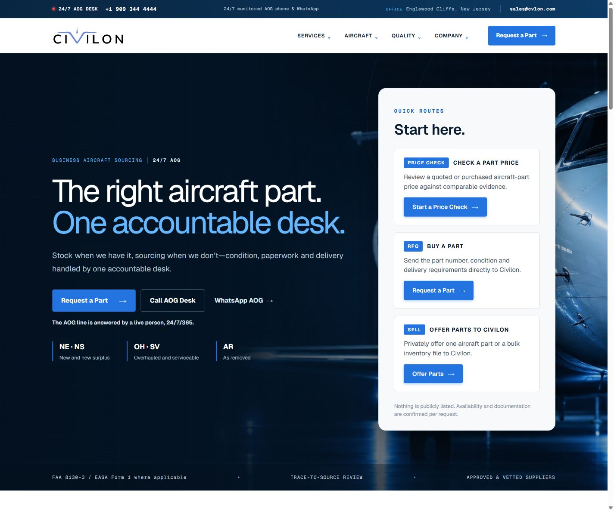
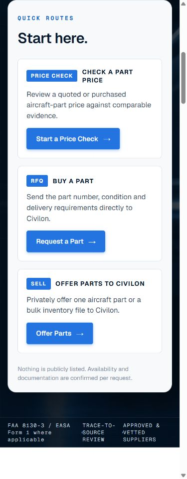

# Quick Routes, favicon, and public form feedback review

## Scope

- Rebuilds the homepage Quick Routes card from the supplied reference using Civilon's existing tokens and self-hosted Geist fonts.
- Installs the supplied Civilon favicon set and web manifest.
- Focuses and scrolls to success confirmations and failure summaries on Request a Part, Offer Parts, Price Check, and the legacy service RFQ form.
- Makes reduced-motion feedback scrolling immediate.

No admin workflow, transaction contract, API route, schema, scheduled function, or email template changed.

## Local browser verification

- Desktop: 1440 px wide, no horizontal overflow, three bordered routes, matching chips and filled buttons.
- Mobile: 390 px wide, no horizontal overflow, route buttons remain below the descriptions and align left.
- Quick Routes now always stack the chip/title, full-width description, and left-aligned button. At 1440 px the descriptions use two lines across about 296 px; at 390 px they use two or three lines across 264 px.
- Civilon Geist reports loaded.
- Request a Part, Offer Parts, and Price Check error summaries scroll to 16 px below the viewport edge and receive keyboard focus.
- Favicon and manifest assets return HTTP 200; the ICO contains 16, 32, and 48 px images.

## Deploy Preview verification

- Preview: <https://deploy-preview-48--cvlon.netlify.app/>
- Price Check TEST submission succeeded with reference `PC-V21EDR8HV0`; the `Price Check received` heading received keyboard focus and settled 16 px below the viewport edge.
- Request a Part TEST submission `TEST-PR48-BUY` reached the preview API, which returned `Requests are temporarily unavailable`; the error summary received keyboard focus and settled about 16 px below the viewport edge.
- Offer Parts TEST submission `TEST-PR48-SELL` reached the preview API, which returned `Submissions are temporarily unavailable`; the error summary received keyboard focus and settled about 16 px below the viewport edge.
- The Buy and Sell preview failures are recorded as environment limitations rather than successful references; no fake backend record or success claim was created.
- Price Check, Buy, and Sell share the same focus/scroll helper but render separate success-confirmation components. One production TEST Buy and one production TEST Sell are therefore required immediately after deployment.
- All favicon and manifest assets respond with HTTP 200 on the preview. Netlify's obsolete `/favicon.ico` rewrite to the removed placeholder was deleted and covered by a regression test.

## Screenshots

